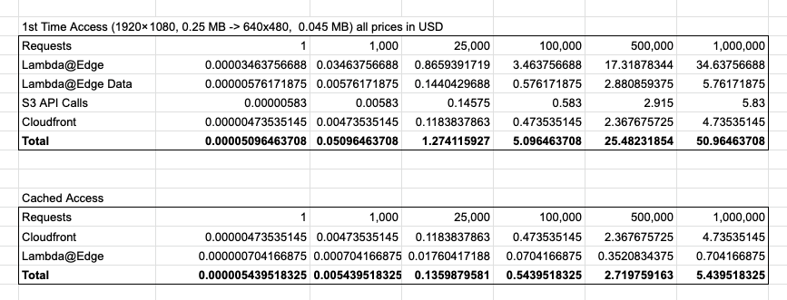

# CloudFront Image Proxy

Make CloudFront resize images "on the fly" via lambda@edge, cache it and persists it in S3. Utilises [Sharp](https://github.com/lovell/sharp) for image transformations.


Illustration & inspiration from [this blog post](https://aws.amazon.com/blogs/networking-and-content-delivery/resizing-images-with-amazon-cloudfront-lambdaedge-aws-cdn-blog/)

## Package & Deploy

This makes use of the [AWS CDK](https://github.com/aws/aws-cdk)

```
yarn install
cdk deploy
```

## Usage

Once deployed, upload an image (example.jpg) to the created S3 bucket in an `images` folder (`images/example.jpg`). Now you can request this image via the Cloudfront distribution domain `https://<distribution>.cloudfront.net/images/example.jpg`, or generate other versions of it like that `https://<distribution>.cloudfront.net/images/example.jpg?d=200x200`.

At the moment, there's little sanity checking or error handling, and the only implemented image transformation option is the resizing. However, exposing more options of `sharp` is just a bunch of typing ;) Check the end of the Readme for more ideas.

## Cost Estimation

It's not really straightforward to estimate the pricing. The [AWS Calculator](https://calculator.aws) is not helpful for the resources used here. A back of the napkin estimate for an example image taken from [unsplash](https://unsplash.com/photos/Z1tDa4nEUnM) (4899 × 3266, 1.8 MB):


While data transfer from AWS origins to Cloudfront is free, data transfer to [Lambda@edge is not](https://aws.amazon.com/lambda/pricing/#Lambda.40Edge_Pricing) (unless in the same region). Therefore, the data transfer cost seems to be a significant part of the equation. I think it would make sense, to generate a few (small / medium / large) versions after the image upload, so that the data transfer is not that costly. See this example, where the same image got transformed to 1920x180 and just 250 KB:



Interestingly enough, the processing time of the image conversion lambda isn't much different for both versions. The next improvement which could make sense, is either moving the Bucket in the region where most of the traffic is happening, or to create an API Gateway / Lambda combo to perform the actual image conversion wihin one region.

### SaaS Comparison

Comparing this with a service like [imgix](https://www.imgix.com/):

- 1000 original images access per month (all conversions included): 3 USD
- 1 GB CDN data transfer: 0.08 USD

Assuming we generate 10 versions for each original image, this Cloudfront proxy clocks in at around 0.85 USD for 10k generated images (inkl CDN traffic). Since CDN traffic cost for subsequently cached image requests is more or less the same for imigix and Cloudfront we can ignore this factor.

The Cloudfront version runs at roughly 30% of the cost of imgix. However, since imgix is a SaaS offering, it's an unfair comparison and you should take engineering time and opertional burdens into account. Having said that, it's still interesting to see those numbers side by side.

If you're interested in more details about the cost estimation, get in touch please.

## Lambda@Edge Gotchas

- Functions have to reside in `us-east-1`
- No environment variables
- Viewer-* functions are limited to 5 seconds execution and 128 MB RAM [See here](https://docs.aws.amazon.com/AmazonCloudFront/latest/DeveloperGuide/cloudfront-limits.html#limits-lambda-at-edge)
- Response-* functions mostly normal Lambda limits
- Response-* response size is limited to 1 MB - (see for a potential solution for bigger images https://stackoverflow.com/questions/55064286/lambdaedge-gives-502-only-for-some-images)
- CloudWatch logs appear at the closest option to the edge location of a request

## Further Ideas

- [ ] Split lambda@edge functions into separate stack, so not all the resources have to be deployed to `us-east-1`
- [ ] Unit / Integration tests
- [ ] Cloudinary compatible URL param structure
- [ ] Make the resizing more resilient (allow something like `x300` to scale one dimension dynamically)
- [ ] Change File Structure in S3 to make it easy to delete files - something like images/<originalfilehash>/300x200/<originalfilename>
- [ ] Pre Generate low res images for large images to improve conversion speed (e.g. 6000x4000 could pre generate 3000x2000(high) / 1000x667(medium) / 500x226(small))
- [ ] Option for snap dimensions (401x303 => 400x300)
- [ ] Expose more Sharp features
- [ ] Client libraries
- [ ] On-Demand external image source e.g. fetch original image from mydomain.com and persist it in S3
- [ ] Add Kinsesis Firehose to aggregate all CloudWatch logs from functions across all edge locations
- [ ] Multiple Tenants
- [ ] Provide packages as [jsii packges](https://github.com/aws/jsii) for Python / C# / Java
- [ ] Analytics / Dashbords / Reporting

## Similar projects

### Standalone Server

- [Imaginary](https://github.com/h2non/imaginary)
- [Imgproxy](https://github.com/imgproxy/imgproxy)
- [Imageproxy](https://github.com/willnorris/imageproxy)

## AWS S3 Trigger

- [Retinal](https://github.com/adieuadieu/retinal)

## AWS API Gateway

- [imageResize](https://github.com/yapawa/imageResize)

## SaaS

- [Cloudinary](https://cloudinary.com/)
- [imgix](https://www.imgix.com/)
